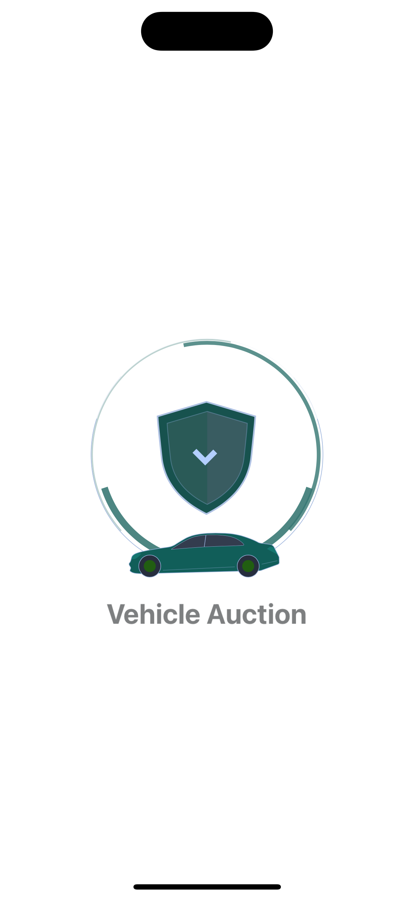
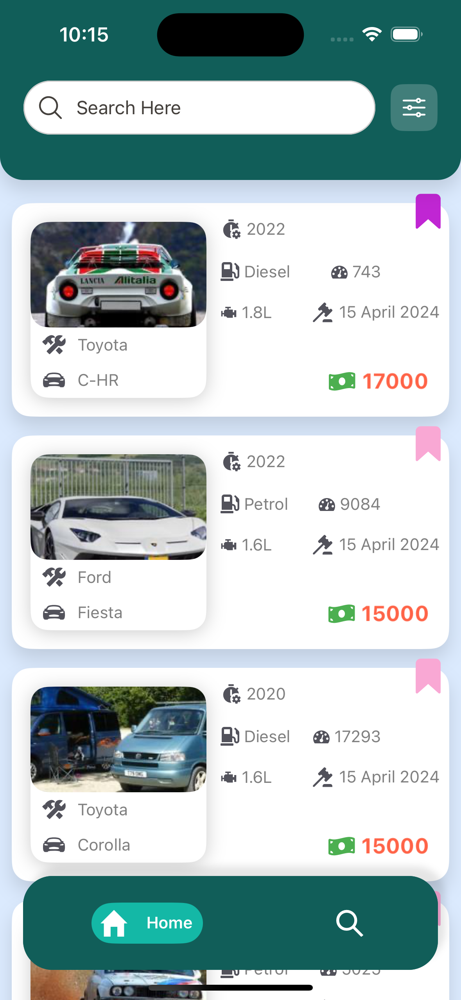
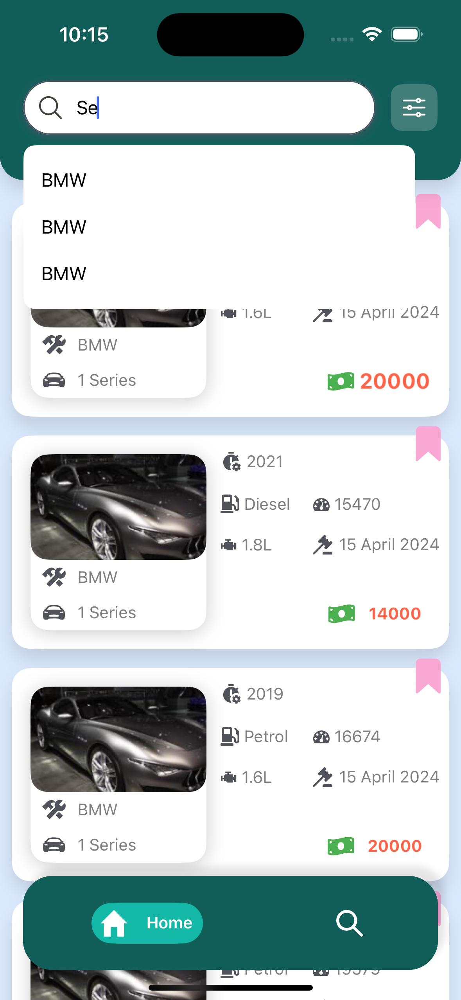
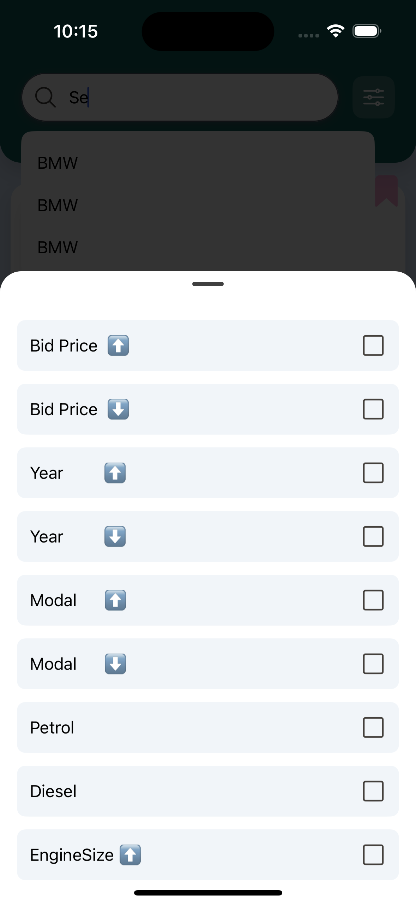
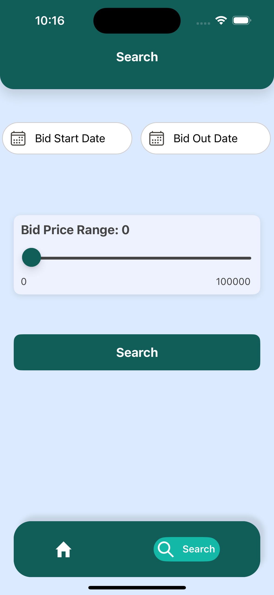
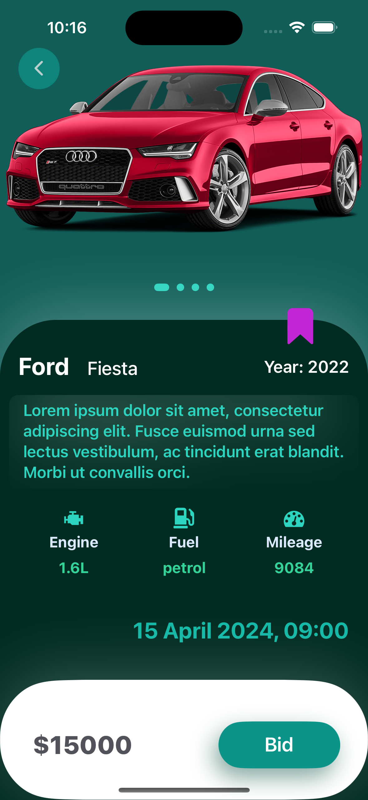

# Vehical Auction

## Description
This is a React Native project built as part of a technical assessment for a React Native Developer position. The goal of the project was to analyze the provided API and explore how many features could be built using a small dataset, focusing on creating a user-friendly and interactive experience.

I thoroughly enjoyed working on this task, despite the challenge of using my "slow computer" (my little tortoise). I aimed to cover as much as possible within the given time, but there are still a few areas I'd love to explore further to improve both the code and the features.

For now, here’s what I’ve completed. Let’s see how we can run this project on your computer so you can experience it firsthand. Ready? Let’s go!

---

## Table of Contents

- [Vehical Auction](#vehical-auction)
  - [Description](#description)
  - [Table of Contents](#table-of-contents)
  - [Requirements](#requirements)
- [Getting Started](#getting-started)
  - [Installation](#installation)
    - [1. Clone the repository](#1-clone-the-repository)
    - [How to Run the Project on iOS/Mac](#how-to-run-the-project-on-iosmac)
  - [Step 1: Start the Metro Server](#step-1-start-the-metro-server)
- [Project Details and screen](#project-details-and-screen)
  - [Step 1: Splash Screen](#step-1-splash-screen)
  - [Step 2: Home Screen](#step-2-home-screen)
  - [Step 3: Home Screen Filter Button](#step-3-home-screen-filter-button)
  - [Step 4: Search screen](#step-4-search-screen)
  - [Step 5: Vehical Details Screen](#step-5-vehical-details-screen)
- [Future work and imporvements:](#future-work-and-imporvements)
    - [Project Approach and Reasons](#project-approach-and-reasons)

---

## Requirements

Before you get started, make sure you have the following installed on your system:

- [Node.js](https://nodejs.org/) >= 14.x.x
- [Yarn](https://yarnpkg.com/) or [npm](https://www.npmjs.com/) >= 6.x.x
- [React Native CLI](https://reactnative.dev/docs/environment-setup)
- Xcode (for iOS development)
- Android Studio (for Android development)

---
This is a new [**React Native**](https://reactnative.dev) project, bootstrapped using [`@react-native-community/cli`](https://github.com/react-native-community/cli).

# Getting Started

>**Note**: Make sure you have completed the [React Native - Environment Setup](https://reactnative.dev/docs/environment-setup) instructions till "Creating a new application" step, before proceeding.


## Installation

To install and set up the project on your local machine, follow these steps:

### 1. Clone the repository

```bash

git clone https://github.com/Vibepasson123/VehicleAuction.git

cd VehicleAuction
```
### How to Run the Project on iOS/Mac

Onnce you are in the project folder install the node dependencies with the following command 
```bash 
 npm install or  yarn install 
```
After all the packages have been installed, for macOS, you will need to install the iOS dependencies using CocoaPods. Run the following command:

 ```bash
  cd ios && pod install
  ````
 Once the dependencies are installed, and you're ready to run the project. You  can use the following commands to launch the app:

  If you are running the app on Android, please check this file and update it according to your configuration. Under the android folder, there is a file called local.properties. Add your settings here on this line.

 ```bash
   sdk.dir=/Users/your-computer/Library/Android/sdk
   yarn ios or yarn android 
   ```
 
 To run with Npm we can have these commands

 ```bash
 npx pod-install ios 
    
 npx react-native run-ios
      
 npx react-native run-android
```

## Step 1: Start the Metro Server

First, you will need to start **Metro**, the JavaScript _bundler_ that ships _with_ React Native.

To start Metro, run the following command from the _root_ of your React Native project:

```bash
# using npm
npm start

# OR using Yarn
yarn start
```


If you can't get this to work, see the [Troubleshooting](https://reactnative.dev/docs/troubleshooting) page.
 and you can see the app running 

# Project Details and screen 
  The project has four main screens: Home, Search, and Vehicle Details they are like this 
 
   

  ## Step 1: Splash Screen   
    This is simple animated splash screen of the app 
  
  

   ## Step 2: Home Screen
    The home screen consists of four major parts or components: a header with a search input and a filter button.

  It works like this: when the user searches or types in the search input, after three characters, the application will globally filter the data from all the fields. Additionally, it will display a list of three suggestions that match the search, which you can see in the next image.

  Furthermore, it has a bottom tab bar to navigate between the screens.


  

  ## Step 3: Home Screen Filter Button

  When the user presses the filter button on the header on the right side, it will toggle a bottom sheet with all the filter parameters. Users can filter according to their needs, and if the data becomes empty after applying the filters, they can press the "Clear Filter" option below.

  I understand this implementation may not be ideal, but due to time constraints and health issues, I could not place it in the best position. I apologize for that.

  
  
  ## Step 4: Search screen

  If the user needs a custom search based on the date and bidding value, they can do it here. The user can simply select the date from the calendar and choose the bidding value from the slider to fetch their custom results. If no results exist, the user will see an empty screen.

 
 
  ## Step 5: Vehical Details Screen 

   This is the representation of how a unique car will be displayed with all its details. Here, you can see that it has a favorite button and a bid button. The bid button is for demonstration purposes only, while the favorite button works both in the list card and the vehicle detail screen.

  

 There are several more screens that users can explore while running the project and having fun.
 


 
  # Future work and imporvements: 
  there are pleanty of reoom for imporovements which i would like to do if i get the time specially of the test side.
  
  ### Project Approach and Reasons

1. **State Management with Redux:**
   - I chose Redux for state management to maintain a predictable state container, allowing for easier debugging and testing. It provides a single source of truth, making it easier to track changes in the application state.

2. **Maintaining Data Integrity:**
   - To ensure data integrity, I assigned unique IDs to the array data. This prevents issues related to duplicate entries and allows for better handling of data manipulation.

3. **Separation of Concerns:**
   - I implemented a separate Redux store for managing favorites. This separation keeps the application’s state organized, ensuring that user preferences can be handled independently from the core dataset.

4. **User Experience Consideration:**
   - The design and functionality were developed with user experience in mind. Features such as easy filtering and searching were prioritized to make data retrieval intuitive and efficient.

5. **Data Preservation:**
   - By managing favorites separately, the raw JSON data remains uncluttered. This approach prevents any potential loss of original data and makes it easier to maintain and update the dataset.

6. **Scalability:**
   - The project was designed with scalability in mind. By utilizing Redux, the application can easily handle an increase in complexity and user interaction without sacrificing performance.

7. **Maintainability:**
   - The code structure and organization were designed to be maintainable, facilitating future enhancements and feature additions. Clear documentation and a modular design will make it easier for other developers to contribute to the project.

8. **Testing Limitations:**
  - I do not have access to an Android device, so I could not test the application on a real device. I do not fully trust the results provided by emulators and simulators, as they may not accurately reflect real-world performance and user interactions. Due to my health issues and hospital appointments, I could not achieve everything I wished to do, especially regarding testing and creating a continuous pipeline through CodePush. However, I managed to write a few unit tests for the helper functions in this project. I was unable to write mock tests for each component and screen, which I would love to do if I have some spare time.

  

